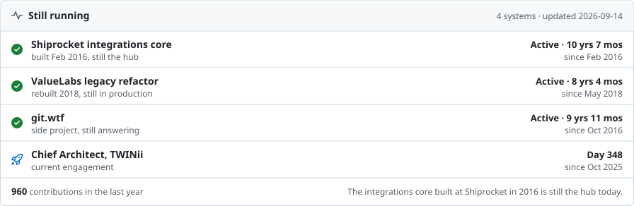

<a href="https://msingh.com">
  <picture>
    <source media="(prefers-color-scheme: dark)" srcset="assets/hero-dark.svg">
    
  </picture>
</a>

  &nbsp;
  &nbsp;
  &nbsp;
  &nbsp;
  

Chief Architect at TWINii · Fractional CTO and AI production advisor · The layer after the demo

### Hi, I'm Mandeep

I'm Chief Architect at [TWINii](https://twinii.ai), where we build real-time AI twins of real people: conversational AI with cloned voice, memory and guardrails, running across web, mobile and voice. I own the architecture end to end, from the model layer to release. Alongside that I take on a small number of fractional CTO and production-advisory engagements a year.

I work at the layer after the demo. An agent that answers well in a demo still has to survive real users, partial tool failures, languages the evals never covered, and a budget. That is the part of AI engineering I care about, and the part I write about.

Some of it, in numbers I am comfortable defending:

- **8× ARR** at Devnagri AI over two and a half years as Fractional CTO, on an AI localisation platform running 22 languages: LLMOps, multilingual pipelines, hybrid cloud.
- **Five-plus years** as Software Architect for Balluun, a Silicon Valley B2B market network, through its cloud-native migration.
- **45 days** from day one to first product live at HumanFirewall, as Acting CTO.
- **Ten years in production.** The integrations core I built at Shiprocket in 2016 is still the hub today.

### Now

- **Real-time voice agents** at TWINii: latency budgets, interruption handling, memory that survives a session, guardrails that survive a user.
- **Spec-driven development** with AI-assisted engineering standards, so agents write code inside boundaries the team agreed on first.
- **Security and supply-chain hardening** across the organisation. That programme is why [polinrider-cleaner](https://github.com/meSingh/polinrider-cleaner) exists.
- **Cost.** I read the token bill the way I used to read the AWS bill. Most agent architectures are slow and expensive for the same reason: work waiting on outputs it never needed.

<picture><source media="(prefers-color-scheme: dark)" srcset="assets/still-running-box-dark.svg"></picture>

### What I work on

- **Production AI:** real-time voice agents, agent orchestration, retrieval-augmented generation, evals, guardrails, LLMOps, prompt and harness versioning, fine-tuning, AI unit economics, multilingual AI.
- **AI architecture:** streaming speech-to-text and text-to-speech, voice cloning, agent memory and durable state, tool use, observability, cost control, zero-downtime migrations.
- **Systems:** Node.js and TypeScript, Python and FastAPI, PostgreSQL, MongoDB, Redis, RabbitMQ, React and Next.js, Flutter, Google Cloud, AWS, Azure, Kubernetes, Docker, hybrid cloud.
- **Leadership:** fractional CTO, production-readiness reviews, technical due diligence for AI products, spec-driven development, software supply-chain security, engineering standards for AI-assisted teams.

### Stats

<a href="https://github.com/meSingh"><picture><source media="(prefers-color-scheme: dark)" srcset="https://streak-stats.demolab.com/?user=meSingh&theme=github-dark-blue&hide_border=true&card_width=896"></picture></a>

### Working together

A small number of engagements a year, alongside TWINii:

- **Production-readiness review** of an AI product before it meets scale, a customer or an investor.
- **Fractional CTO and production counsel** for seed to Series B teams that have a demo and need a system.
- **Technical due diligence** on AI products, for the people writing the cheque.

If one of those is you, [book an intro call](https://cal.com/msingh/lets-connect). Based in Delhi, working across UK, US and India hours.

Tools I use daily 

Mandeep Singh &nbsp;·&nbsp; Greater Delhi Area &nbsp;·&nbsp; <a href="https://msingh.com">msingh.com</a> &nbsp;·&nbsp; cards update daily from <a href="https://github.com/meSingh/meSingh/tree/master/scripts">scripts/</a>

