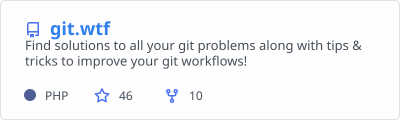

<a href="https://msingh.com">
  <picture>
    <source media="(prefers-color-scheme: dark)" srcset="assets/hero-dark.svg">
    
  </picture>
</a>

  &nbsp;
  &nbsp;
  &nbsp;
  &nbsp;
  

### Hi, I'm Mandeep

I'm Chief Architect at [TWINii](https://twinii.ai), where we build real-time AI twins of real people: conversational AI with cloned voice, memory and guardrails, running across web, mobile and voice. I own the architecture end to end, from the model layer to release. Alongside that I take on a small number of fractional CTO and production-advisory engagements a year.

I work at the layer after the demo. An agent that answers well in a demo still has to survive real users, partial tool failures, languages the evals never covered, and a budget. That is the part of AI engineering I care about, and the part I write about.

Some of it, in numbers I am comfortable defending:

- **8× ARR** at Devnagri AI over two and a half years as Fractional CTO, on an AI localisation platform running 22 languages: LLMOps, multilingual pipelines, hybrid cloud.
- **Five-plus years** as Software Architect for Balluun, a Silicon Valley B2B market network, through its cloud-native migration.
- **45 days** from day one to first product live at HumanFirewall, as Acting CTO.
- **Ten years in production.** The integrations core I built at Shiprocket in 2016 is still the hub today.

### Now

- **Real-time voice agents** at TWINii: latency budgets, interruption handling, memory that survives a session, guardrails that survive a user.
- **Spec-driven development** with AI-assisted engineering standards, so agents write code inside boundaries the team agreed on first.
- **Security and supply-chain hardening** across the organisation. That programme is why [polinrider-cleaner](https://github.com/meSingh/polinrider-cleaner) exists.
- **Cost.** I read the token bill the way I used to read the AWS bill. Most agent architectures are slow and expensive for the same reason: work waiting on outputs it never needed.

<picture>
  <source media="(prefers-color-scheme: dark)" srcset="assets/ledger-dark.svg">
  
</picture>

### What I work with

**AI** 

**Backend** 

**Product** 

**Platform** 

### Open source

Most of my work since 2021 lives in client and employer repositories. These two are the public exceptions.

<table>
  <tr>
    <td width="50%"><a href="https://github.com/meSingh/polinrider-cleaner"><picture><source media="(prefers-color-scheme: dark)" srcset="assets/pin-polinrider-cleaner-dark.svg"></picture></a></td>
    <td width="50%"><a href="https://github.com/meSingh/git.wtf"><picture><source media="(prefers-color-scheme: dark)" srcset="assets/pin-git-wtf-dark.svg"></picture></a></td>
  </tr>
</table>

### Stats

<table>
  <tr>
    <td width="50%"><a href="https://github.com/meSingh"><picture><source media="(prefers-color-scheme: dark)" srcset="assets/stats-dark.svg"></picture></a></td>
    <td width="50%"><a href="https://github.com/meSingh"><picture><source media="(prefers-color-scheme: dark)" srcset="https://github-readme-streak-stats.herokuapp.com/?user=meSingh&background=11161E&border=2B3240&ring=E3D1AC&fire=E3D1AC&currStreakNum=F6F3ED&sideNums=CBC5B3&currStreakLabel=E3D1AC&sideLabels=8F8A7E&dates=7E7A6E&border_radius=10&hide_title=true"></picture></a></td>
  </tr>
</table>

### How I think about production AI

> An agent is not failing when it says "I don't know." It fails when it invents an answer to avoid saying it.

> `request → rule → action → stop` is not a graph problem. It is an `if/else` problem wearing a lanyard.

> Model judgement for ambiguity. Code and rules for everything deterministic. Hard boundaries where mistakes matter.

> The prompt is not always an instruction. Sometimes it is a slightly chaotic transfer of context between two minds.

I write about agent harness drift and versioning prompt files, interrupting agents instead of reviewing them at the end, language-dependent model behaviour and what evals miss, durable state for agents (boring, external, disposable), and the economics of a 600-million-token month. The longer versions are on [LinkedIn](https://www.linkedin.com/in/mesingh9/recent-activity/all/).

### Working together

A small number of engagements a year, alongside TWINii:

- **Production-readiness review** of an AI product before it meets scale, a customer or an investor.
- **Fractional CTO and production counsel** for seed to Series B teams that have a demo and need a system.
- **Technical due diligence** on AI products, for the people writing the cheque.

If one of those is you, [book an intro call](https://cal.com/msingh/lets-connect). Based in Delhi, working across UK, US and India hours.

Mandeep Singh &nbsp;·&nbsp; Greater Delhi Area &nbsp;·&nbsp; <a href="https://msingh.com">msingh.com</a> &nbsp;·&nbsp; the ledger, stats and repo cards regenerate daily from <a href="https://github.com/meSingh/meSingh/tree/master/scripts">scripts/</a>

